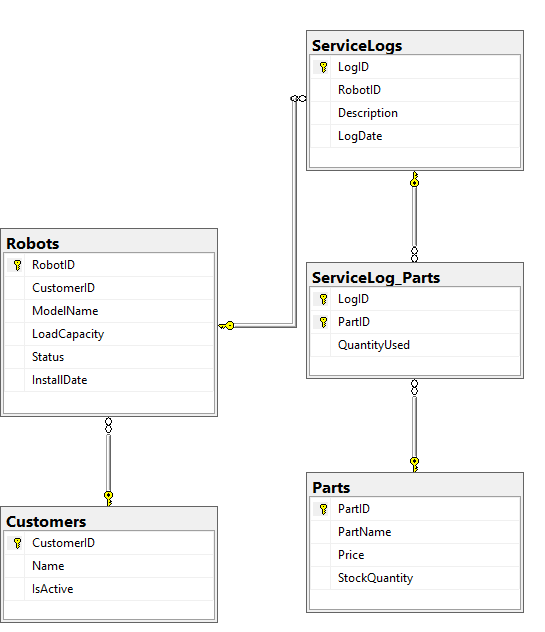

# Evidence Servisu Průmyslových Robotů

**Autor:** Stanislav Petr

---

## 1. Analýza a návrh řešení

### 1.1 Popis problému

Cílem projektu je vytvořit desktopovou aplikaci pro evidenci servisních zásahů na průmyslových robotech. V praxi servisní technik potřebuje nástroj, který mu umožní přímo u zákazníka zaznamenat provedené opravy a spotřebované náhradní díly.

Klíčovým požadavkem je:

* zajištění konzistence skladu (automatický odpis dílů při jejich použití),
* přehledná evidence historie oprav pro jednotlivé stroje.

---

### 1.2 Datový model (ERD)

Jádrem systému je relační databáze **Microsoft SQL Server (MSSQL)**. Datový model je navržen ve **3. normální formě (3NF)** a efektivně popisuje vazby mezi roboty, zákazníky, servisy a náhradními díly.

#### Entity databáze

* **Customers (Zákazníci)**
  Vlastníci robotů. Obsahuje název firmy a příznak aktivity.

* **Robots (Roboti)**
  Konkrétní stroje zákazníků (vazba 1:N na Customers). Každý robot má definovaný model, nosnost (*LoadCapacity*), status a datum instalace.

* **Parts (Sklad dílů)**
  Číselník náhradních dílů. Eviduje název dílu, aktuální cenu a stav skladu (*StockQuantity*).

* **ServiceLogs (Servisní záznamy)**
  Evidence servisních zásahů (vazba 1:N na Robots). Obsahuje popis závady a datum zásahu.

* **ServiceLog_Parts (Vazba M:N)**
  Spojovací tabulka evidující, jaké díly a v jakém množství (*QuantityUsed*) byly použity při konkrétním servisním zásahu.

---

### 1.3 Architektura aplikace

Aplikace je navržena dle návrhového vzoru **Repository Pattern** (zadání D1), který zajišťuje striktní oddělení aplikační logiky od uživatelského rozhraní.

#### Vrstvy aplikace

* **Prezentační vrstva (UI)**
  Implementována pomocí knihovny **tkinter**. Zajišťuje formuláře, tabulky, práci s uživatelem a základní validaci vstupů.

* **Datová vrstva (Repository)**
  Třída `RobotRepository` v souboru `repository.py` zapouzdřuje veškerou komunikaci s databází. Obsahuje SQL dotazy i transakční logiku. UI vrstva nemá přímý přístup k SQL příkazům.

* **Databáze**
  Microsoft SQL Server (Express), ke kterému se aplikace připojuje pomocí ODBC ovladače (**pyodbc**).

---

### 1.4 Klíčové funkce

* **Transakční zpracování**
  Zápis servisního zásahu a odpis použitých dílů probíhá v jedné atomické transakci. Pokud dojde k chybě (např. nedostatek dílů na skladě), je celá operace vrácena zpět (*rollback*).

* **Import dat**
  Hromadné naskladnění náhradních dílů z externího CSV souboru.

* **Reporting**
  Generování finančních přehledů nákladů na opravy s využitím SQL agregačních funkcí.
