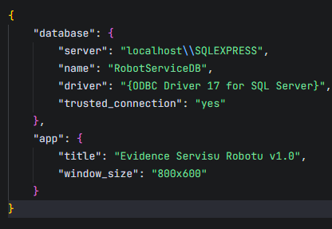
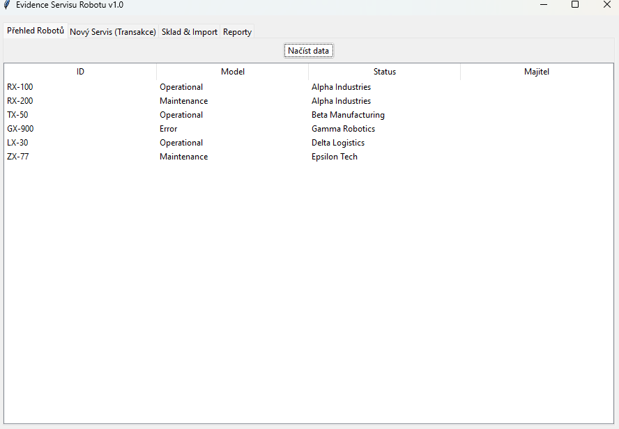
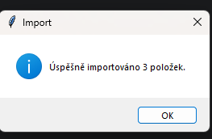
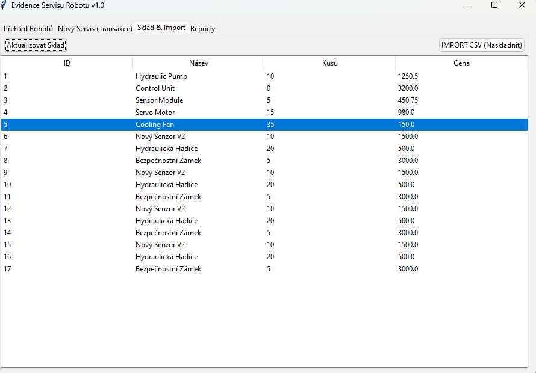

# TS-01: Inicializace aplikace a import skladových zásob

## Popis

Ověření, že aplikace se úspěšně spustí, připojí k databázi a umožní hromadný import skladových položek z CSV souboru.

---

## Kroky testu

### 1. Příprava databáze

1. Otevřít složku `data` v adresáři projektu.
2. Otevřít soubor `database_setup.sql` v nástroji **SQL Server Management Studio (SSMS)**.
3. Spustit skript pomocí tlačítka **Execute**.

**Očekávaný výsledek:**

* Skript proběhne bez chyb ("Commands completed successfully").
* Vytvoří se databáze `RobotServiceDB` včetně všech tabulek.

---

### 2. Konfigurace připojení

1. Otevřít soubor `data/config.json` v textovém editoru.
2. Upravit hodnotu položky `server` na:

   ```
   localhost\\SQLEXPRESS
   ```

   (případně dle názvu SQL Serveru).
3. Soubor uložit.

**Očekávaný výsledek:**

* Konfigurační soubor je uložen s novým nastavením.

    

---

### 3. Spuštění aplikace

1. Spustit soubor `src/main.py`.

**Očekávaný výsledek:**

* Aplikace se spustí bez chyb.
* Otevře se hlavní okno **Evidence Servisu Robotů**.
* Pokud databáze obsahuje data, jsou zobrazena v tabulkách.


---

### 4. Import skladu z CSV

1. Přejít na záložku **Sklad & Import**.
2. Kliknout na tlačítko **IMPORT CSV**.
3. Vybrat soubor `data/nove_dily.csv`.

**Očekávaný výsledek:**

* Zobrazí se informační hláška "Úspěšně importováno".
* Nové položky se objeví v tabulce skladu.


